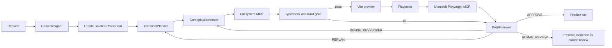

# Multi-Agent Game Builder

> This is not a chatbot or an API-key wrapper. Google ADK executes a five-agent workflow that uses tools, MCP, shared state, browser testing, conditional routing, bounded revision loops, replanning, and automatic retesting.

Multi-Agent Game Builder is a university Agentic AI Lab project. It turns a game request into an isolated Phaser TypeScript/Vite project, then typechecks, builds, previews, browser-tests, reviews, and conditionally revises that project through a real Google ADK workflow.

## Architecture



## Five Production Agents

| Agent | Responsibility | Tool boundary |
| --- | --- | --- |
| `GameDesigner` | Produces game design | No source edits or testing |
| `TechnicalPlanner` | Produces Phaser manifest and implementation plan | No source edits or testing |
| `GameplayDeveloper` | Implements and repairs the generated game | Filesystem MCP scoped to `game_workspace/runs` |
| `Playtester` | Runs real browser tests against the Vite preview | Microsoft Playwright MCP only; no source edits |
| `BugReviewer` | Scores evidence and controls routing | No source edits or tool calls |

There are exactly five production LLM agents. Deterministic Python tools copy templates, validate paths/assets, run npm commands, manage preview processes, and preserve build/test evidence.

## Real Runtime Evidence

The shared ADK state records `run_id`, `run_path`, `game_design`, `game_manifest`, `technical_plan`, `build_result`, `structured_test_report`, `review_decision`, `iteration`, revision/replan counts, route history, approval state, and human-review state.

`GameplayDeveloper` writes only inside a generated run through Filesystem MCP. After every developer turn, the build gate executes `npm_typecheck` and `npm_build`. Playtester is invoked only after both pass and uses Playwright MCP against the real preview. A revised implementation requires a fresh browser report for the new iteration before BugReviewer can approve.

## Routing and Limits

- `APPROVE`: requires a fresh complete passing report, passing typecheck/build, reviewer score at least `85`, and no defects.
- `REVISE_DEVELOPER`: routes to the developer, then rebuilds and retests.
- `REPLAN`: routes to the planner, developer, build gate, and fresh browser test.
- `HUMAN_REVIEW`: preserves artifacts and state, then stops autonomous changes.
- The workflow has a maximum of three iterations and escalates repeated material failures.

## Phaser Pipeline

`game_templates/phaser-2d-production` is the immutable canonical template. Each run copies it into `game_workspace/runs/<run_id>`. It includes reusable Phaser scene flow, responsive sizing, menu/pause/game-over states, HUD, effects/audio/progression hooks, local asset manifest, and a real `window.__GAME_TEST__` bridge.

The bridge exposes `getState()`, `reset()`, `getErrors()`, and an `errors` compatibility alias. Games may additionally expose real-state hooks such as `setScore`, `spawnEnemy`, `teleportPlayer`, `getEntities`, `advanceState`, `triggerWin`, and `triggerLoss`.

## Local Setup

Prerequisites:

- Python virtual environment at `.venv`
- Node.js and npm
- Google ADK credentials configured locally, such as `GOOGLE_API_KEY` or a supported Vertex AI setup
- Microsoft Edge available for Playwright MCP

Gemini is the only supported local model provider for this ADK demo. Install
the Python dependencies with:

```powershell
.\.venv\Scripts\python.exe -m pip install -r requirements.txt
```

Keep Google ADK credentials configured locally, such as `GOOGLE_API_KEY` or a
supported Vertex AI setup. OpenAI keys are not used by this workflow.

## Agentic Lab Web App

Run the local web app with one command:

```powershell
.\scripts\lab.ps1
```

It opens `http://127.0.0.1:8010/` and provides a simple lab UI for the
existing ADK system:

- submit a game prompt
- watch run status
- preview the latest generated game
- open the game fullscreen
- download the built `dist` output as a ZIP
- switch between generated runs

This wrapper does not replace the ADK workflow. It invokes the same
`game_builder` agent and serves finished outputs from
`game_workspace/runs/<run_id>/dist`.

Install template dependencies once:

```powershell
cd game_templates/phaser-2d-production
npm install --no-audit --no-fund
```

Run all deterministic verification:

```powershell
cd C:\Users\Ricardo\Downloads\WWWMasters\MultiAgentGameSystem
.\.venv\Scripts\python.exe -m unittest discover -s tests -q
cd .\game_templates\phaser-2d-production
npx tsc --noEmit
npm run build-nolog
```

## Demo: Normal Pong Run

Start ADK Web on Windows with reload disabled so MCP subprocesses can run:

```powershell
cd C:\Users\Ricardo\Downloads\WWWMasters\MultiAgentGameSystem
.\.venv\Scripts\adk web .\game_builder --host 127.0.0.1 --port 8001 --no-reload
```

Open `http://127.0.0.1:8001/`, select the `game_builder` agent, and submit:

```text
Build a polished compact two-player Pong game with scoring, win and loss states, restart, local approved assets where useful, and complete TestBridge coverage.
```

Use one session for one run. The ADK event/trace panel shows the actual agents, tool calls, state updates, branch route, and model/tool events. Expand the `GameplayDeveloper` event to show Filesystem MCP calls, the build-gate event for npm results, `Playtester` for Playwright MCP calls, and `BugReviewer` for the route and score.

## Demo: Reproducible Revision Loop

This is a safe non-production demonstration mode. It asks the real GameplayDeveloper to introduce one controlled TestBridge defect on its first implementation. Playwright must observe it; BugReviewer must choose `REVISE_DEVELOPER`; the developer repairs it; the build gate and Playwright test run again; then BugReviewer may approve based on fresh evidence.

```powershell
cd C:\Users\Ricardo\Downloads\WWWMasters\MultiAgentGameSystem
.\.venv\Scripts\python.exe -m game_builder.regression_runner pong --demo-mode
```

This command invokes `google.adk.cli run` with ADK shared state `{"demo_mode": true}`. It does not fabricate agents, tool calls, browser evidence, or trace events. Output and observed command metadata are written to `game_workspace/regressions/`.

## REPLAN and HUMAN_REVIEW Demonstrations

For `REPLAN`, submit a game request whose plan is intentionally incomplete, then use the evidence panel to show BugReviewer returning `REPLAN`; the trace must continue through `TechnicalPlanner`, `GameplayDeveloper`, build gate, Playtester, and BugReviewer.

For `HUMAN_REVIEW`, use a failing environment or repeat a materially equivalent critical failure through the bounded retry limit. The `route_history`, `human_review_required`, and `human_review_reason` state values demonstrate the stop condition. Do not claim either route occurred unless it is visible in that session's ADK trace.

## Regression Cases

The deterministic catalog contains `pong`, `breakout`, `asteroid_survival`, `top_down_shooter`, and `maze`.

```powershell
.\.venv\Scripts\python.exe -m game_builder.regression_runner breakout --print-prompt
.\.venv\Scripts\python.exe -m game_builder.regression_runner pong
```

## Security Boundaries

- `.env` and nested `.env` files are ignored and must never be committed.
- Filesystem MCP is rooted at generated runs and cannot access templates, `.venv`, or repository secrets.
- Shell execution is deterministic tooling only; LLMs do not receive arbitrary command execution.
- Generated runs, npm outputs, Playwright output, logs, bytecode, `node_modules`, and `dist` are ignored.
- Browser automation and model credentials remain local for the class demonstration.

## Deployment

The deadline-ready deployment is a local class demonstration. Browser automation plus MCP subprocesses are reliable in the local Windows workflow, but require deliberate process/security design for cloud hosting. A hosted version should run the ADK backend in a trusted environment with server-side credentials and an approved browser-automation worker. No Gemini credentials are bundled into frontend assets.

## Future Work

The Three.js track is deliberately deferred. Phaser, the real five-agent ADK workflow, MCP tools, build gate, browser evidence, bounded routing, and the presentation demo take priority.
